# Experiments Log

## Experiment 1: PoinTr (ShapeNet55) for Shape Completion

**Date:** 2026-03-10
**Goal:** Complete partial point clouds (front-facing only from ZED) into full 3D shapes for grasp planning.

### Setup

- **Model:** PoinTr (ICCV 2021 Oral), transformer-based point cloud completion
- **Checkpoint:** `PoinTr_ShapeNet55.pth` -- trained on all 55 ShapeNet categories
- **Input:** 2,048 points (FPS-downsampled from ~11K partial cloud, normalized to unit sphere)
- **Output:** 8,192 completed points (denormalized back to camera frame)
- **Inference time:** ~30-50ms per object on RTX 3070
- **Repo:** github.com/yuxumin/PoinTr
- **CUDA extensions built:** chamfer_dist, pointnet2_ops, knn_cuda (CUDA 12.8, SM 8.6)

### Results

**Test object:** Red mug on desk, captured live from ZED Mini

#### Before outlier removal
- Significant stray points behind the mug caused by depth bleeding at mask edges
- Stereo matching assigns background depth to object boundary pixels
- The scattered points extended 20-50cm behind the actual object surface

#### After outlier removal (two-stage MAD + statistical)
- Partial point cloud is much cleaner
- Mug shape clearly visible in the "3D Objects" window

#### Shape completion output
- PoinTr produces a completed shape that roughly resembles a mug
- The completed points (lighter shade in "Completed Shapes" window) fill in behind the partial cloud
- **However, the completion quality is disappointing:**
  - The completed geometry is blobby and doesn't match the actual mug shape
  - Hallucinated points don't align well with the real object
  - The handle region is poorly reconstructed
  - Overall shape looks like a rough approximation, not a clean mug

### Screenshots

#### Run 1: Before outlier removal
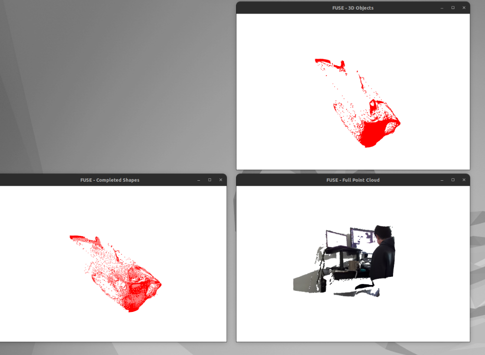
- "3D Objects" (top right): partial cloud with stray depth-bleed points trailing behind the mug
- "Completed Shapes" (bottom left): PoinTr output -- blobby, with noise from the stray input points
- "Full Point Cloud" (bottom right): full scene for reference

#### Run 2: After outlier removal, completion enabled
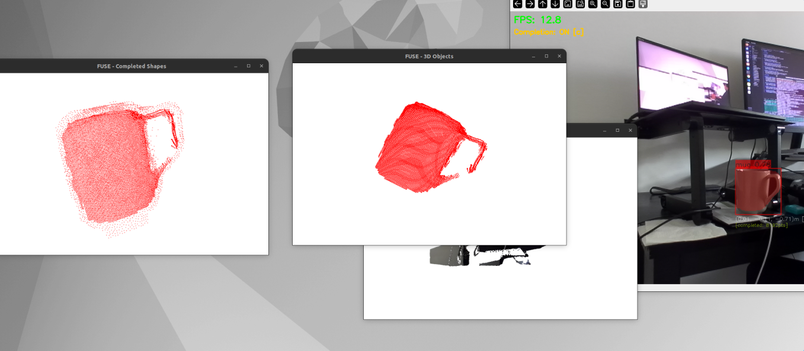
- "3D Objects" (center): clean partial cloud of the mug, no stray points
- "Completed Shapes" (left): PoinTr completion -- fills in back of mug but shape is approximate
- FPS: 12.8 with completion ON
- The mug is recognizable but the completed geometry is rough and blobby

### Analysis: Why PoinTr Underperforms on Real Data

**Root cause: synthetic-to-real domain gap**

1. **Orientation mismatch:** PoinTr was trained on ShapeNet objects in canonical pose (mug upright, handle in consistent direction). Our ZED captures are in camera frame -- the mug is rotated/tilted arbitrarily. PoinTr has no category input, so it must guess the shape purely from geometry. A mug in camera frame looks nothing like ShapeNet's canonical partials.

2. **Partial view pattern:** ShapeNet training generates partial views by removing clean viewpoint slices from complete synthetic meshes. Real ZED partials only capture the front-facing surface with uneven density (denser near camera center, sparser at edges). The "shape" of the missing region is very different from what the model was trained on.

3. **Point distribution:** ShapeNet points are uniformly sampled from clean meshes. ZED points are noisy, have variable density, and include stereo artifacts even after outlier removal.

4. **No category conditioning:** PoinTr is category-agnostic -- it doesn't know it's looking at a mug. It hallucinates geometry based on whatever the partial cloud vaguely resembles in its training distribution.

5. **Scale/proportion:** Real objects have different proportions than ShapeNet's idealized CAD models.

### Conclusion

PoinTr with ShapeNet55 weights is **not suitable** for real-time shape completion on live ZED sensor data. The synthetic-to-real domain gap is too large. The model was designed for and evaluated on synthetic benchmarks (ShapeNet, PCN), not real-world noisy partial scans.

### Next Steps

Exploring **image-to-3D models** instead of point-cloud-only completion. These models take an RGB image crop as input and generate a full 3D mesh, trained on massive real/rendered image datasets (Objaverse, 800K+ objects). No synthetic-to-real gap since they understand real images natively.

**Candidates:**

| Model | Input | Output | Speed | Why it might work |
|-------|-------|--------|-------|-------------------|
| TripoSR (Stability AI) | Single RGB crop | 3D mesh | ~0.5s | Fast, MIT license, trained on Objaverse |
| InstantMesh | Single RGB crop | 3D mesh | ~10s | Higher quality, slower |
| Trellis (Microsoft) | Image + text | 3D mesh / Gaussian | ~5s | State-of-art, multimodal |
| Hunyuan3D 2.0 (Tencent) | Text + image | 3D mesh | ~10s | Uses both text label and RGB crop |

**Advantage over PoinTr:** We already have the RGB crop from YOLOE's bounding box -- it's free input. RGB carries much richer shape information than a noisy partial point cloud. These models also handle arbitrary viewpoints since they're trained on diverse camera angles.

---

## Experiment 2: TripoSR (Single-Image-to-3D) for Shape Completion

**Date:** 2026-03-10
**Goal:** Replace PoinTr with an image-based 3D reconstruction model. Use the RGB crop from YOLOE's bounding box to generate a full 3D mesh, then align it to the ZED partial point cloud.

### Setup

- **Model:** TripoSR (Stability AI + Tripo, March 2024), single-image-to-3D mesh
- **Backbone:** DINOv2 image encoder + transformer + NeRF-style triplane decoder
- **Training data:** Objaverse (~800K 3D objects rendered from multiple viewpoints)
- **Input:** Single RGB image crop (512x512), white background, object isolated via YOLOE mask
- **Output:** Textured 3D mesh (extracted via marching cubes at resolution 192)
- **Inference time:** ~0.7s inference + ~2.6s mesh extraction = ~3.3s total on RTX 3070
- **Repo:** stabilityai/TripoSR (HuggingFace)
- **Marching cubes:** Patched to use scikit-image (torchmcubes failed to build with CUDA)

### Pipeline

1. YOLOE detects mug → bounding box + segmentation mask
2. Crop RGB using bbox, apply mask with erosion (5x5 kernel) to remove edge bleed
3. Composite masked object onto white background, pad to square, resize to 512x512
4. TripoSR inference → scene code → mesh extraction (resolution=192, chunk_size=4096)
5. Clean mesh: remove disconnected components, keep largest
6. Sample 8,192 points from mesh surface
7. Align to ZED partial cloud: scale matching (bbox diagonal ratio) → FPFH feature extraction → RANSAC global registration → ICP refinement

### Results

**Test object:** Dark/gray mug on desk, captured live from ZED Mini

#### Attempt 1: Bbox crop + gray background (145x145 upscaled)
- **Input:** Tight bbox crop at native resolution (~145px), composited onto 50% gray background
- **Mesh output:** Boxy wedge shape, not recognizable as a mug
- **Alignment:** Brute-force rotation + ICP, fitness=0.000 (zero correspondences)
- **Cause:** Crop too small (145px upscaled = very blurry), gray background wrong for model, background elements visible in crop

#### Attempt 2: Mask-isolated crop + white background (512x512)
- **Input:** YOLOE mask with erosion, white background, resized to 512x512
- **Mesh output:** Still a boxy/wedge shape, not recognizable as a mug
- **Alignment:** FPFH + RANSAC (fitness=0.282, 886 correspondences) → ICP (fitness=0.204, RMSE=0.0018m)
- **Improvement:** Alignment now finds correspondences, but the mesh shape is still wrong

### Screenshots

#### Attempt 2 (latest)
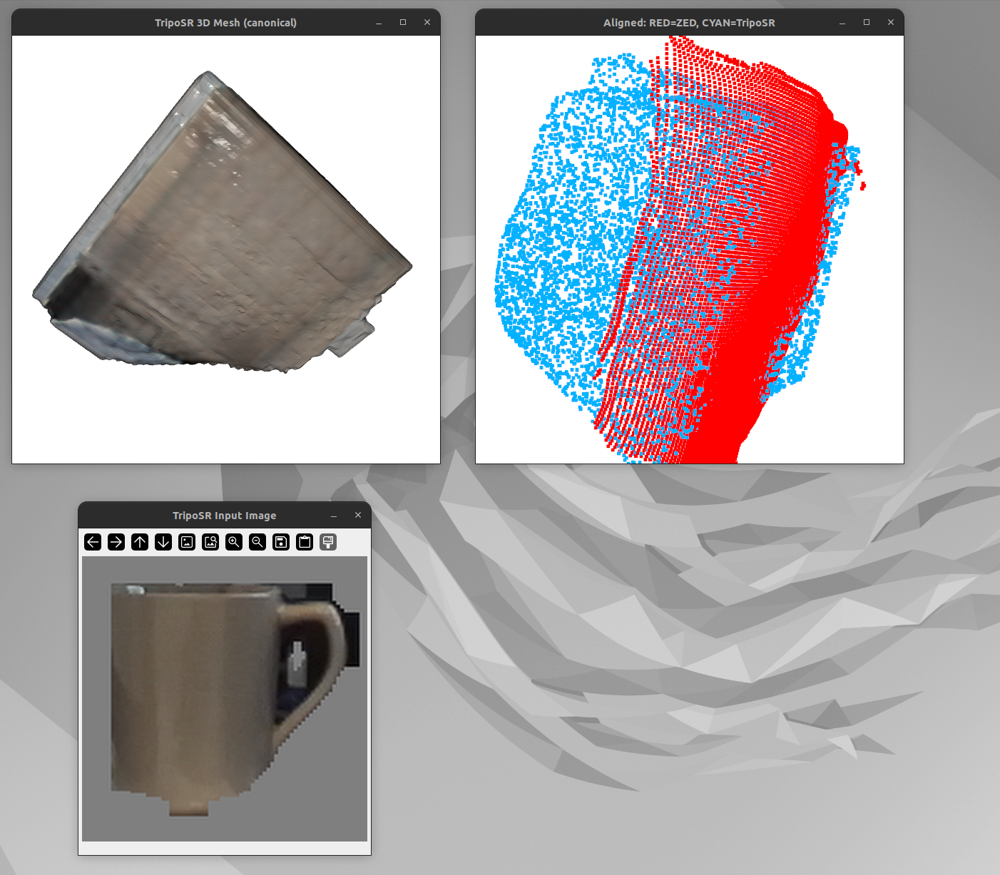
- **Bottom-left (Input):** Mug crop with white background — mask isolation working, but pixelated due to upscaling from ~145px native resolution
- **Top-left (Mesh):** TripoSR canonical mesh — boxy wedge, no mug-like features, no handle visible
- **Top-right (Alignment):** RED = ZED partial cloud, CYAN = TripoSR sampled points — partial overlap but shapes don't match

### Analysis: Why TripoSR Fails on This Input

1. **No semantic understanding:** TripoSR is purely geometry-from-appearance — it has no concept of what a "mug" is. It doesn't know a mug should have a hollow interior (for holding liquid), a hole under the handle (for gripping), or cylindrical symmetry. It just reconstructs whatever 3D shape matches the image silhouette, producing a solid blob instead of a functional object. This is a fundamental architectural limitation — the model lacks category/text conditioning.

2. **Low effective resolution:** The mug bbox in the 720p frame is only ~145 pixels across. Upscaling to 512x512 produces a blurry, pixelated input. TripoSR was trained on sharp, high-quality renders — blurry inputs confuse the DINOv2 encoder.

3. **Dark/reflective surface:** The mug is dark gray/metallic with specular reflections. TripoSR struggles with reflective objects because the appearance is view-dependent and doesn't match Objaverse's mostly diffuse training objects.

4. **Mask edge artifacts:** Even with erosion, the mask edges have staircase artifacts (jagged pixels). At low resolution, these artifacts take up a significant portion of the object boundary.

5. **Objaverse training bias:** TripoSR was trained on Objaverse renders with clean studio lighting and centered objects. Real ZED crops have uneven lighting, motion blur, and sensor noise.

6. **Handle occlusion:** The mug handle is partially self-occluded and dark, making it hard for the model to infer handle geometry from the silhouette alone.

### Potential Improvements

- **Higher resolution capture:** Use ZED at 1080p or 2K mode so the mug bbox is 300+ pixels natively
- **Better background removal:** Use rembg (U2-Net) for cleaner segmentation instead of YOLOE mask
- **Lighting normalization:** Apply histogram equalization or white-balance correction before feeding to TripoSR
- **Text-conditioned models:** Use models that accept text + image (e.g., Hunyuan3D 2.0, Trellis) so the model knows it's reconstructing a "mug" and can infer semantic features like hollow interior and handle hole
- **Multi-view:** Capture from 2-3 viewpoints and use a multi-view reconstruction model

### Conclusion

TripoSR produces poor mesh quality on real ZED crops at 720p resolution. The primary bottleneck is input quality — the mug occupies too few pixels in the 720p frame, and upscaling introduces blur that the model can't recover from. The mesh doesn't resemble the target object, making downstream alignment meaningless regardless of the registration algorithm used.

**Status:** Not viable in current form. Need higher resolution input or a different approach.

---

## Experiment 3: Hunyuan3D-2 (Image-to-3D) for Shape Completion

**Date:** 2026-03-10
**Goal:** Test Hunyuan3D-2 (Tencent) as a higher-quality replacement for TripoSR. Despite being image-only (no text conditioning), evaluate whether its larger model and training data produce semantically correct shapes. Compare three variants: Full, Mini, and Turbo.

### Setup

- **Model family:** Hunyuan3D-2 (Tencent, 2024), DiT-based flow matching for 3D generation
- **Architecture:** DINOv2 image encoder + DiT diffusion transformer + VAE shape decoder + marching cubes mesh extraction
- **Training data:** Objaverse (800K+ 3D objects)
- **Input:** Single RGBA image crop (512x512), object isolated via YOLOE mask, **no text prompt**
- **Pipeline:** `Hunyuan3DDiTFlowMatchingPipeline` — shape generation only (no texture stage)
- **Repo:** github.com/Tencent-Hunyuan/Hunyuan3D-2

**Important note on input:** Hunyuan3D-2's shape generation pipeline **only accepts an image** — there is no text/prompt parameter in the API. We passed only the RGB crop with no text conditioning whatsoever. Despite this, the model correctly inferred that the object is a mug and generated functionally correct geometry (hollow interior, graspable handle). This means **semantic inference is already happening purely from visual features** — the DINOv2 encoder + diffusion model learned enough about object categories from Objaverse training to reconstruct semantically meaningful shapes from appearance alone.

### Variants Tested

| Variant | Model ID | Subfolder | Weights | Params |
|---------|----------|-----------|---------|--------|
| **Full** | `tencent/Hunyuan3D-2` | `hunyuan3d-dit-v2-0` | ~9.2GB | Full size |
| **Mini** | `tencent/Hunyuan3D-2mini` | `hunyuan3d-dit-v2-mini` | ~6.5GB | 0.6B |
| **Turbo** | `tencent/Hunyuan3D-2mini` | `hunyuan3d-dit-v2-mini-turbo` | ~6.5GB | 0.6B (distilled) |

```bash
python test_hunyuan3d.py          # Full
python test_hunyuan3d.py --mini   # Mini
python test_hunyuan3d.py --turbo  # Turbo
```

### Comparison: Inference Time (RTX 3070, 8GB VRAM)

**Test object:** Dark/gray mug on desk, captured live from ZED Mini

| Stage | Full | Mini | Turbo |
|-------|------|------|-------|
| Model loading | 24.4s | 18.5s | 17.7s |
| Diffusion sampling | 46.8s (50 steps, ~0.94s/step) | 9.0s (50 steps, ~0.18s/step) | 5.3s (8 steps, ~0.66s/step) |
| Volume decoding / mesh extraction | 101s (7134 chunks) | ~75s (7134 chunks) | ~104s (7134 chunks) |
| **Total shape generation** | **~151s** | **~87s** | **~109s** |
| Output mesh | 812K verts, 1.6M faces | 791K verts, 1.58M faces | 703–862K verts, 1.4–1.7M faces |

### Comparison: Mesh Quality

| Aspect | Full | Mini | Turbo |
|--------|------|------|-------|
| Recognizable as mug | Yes | Yes (roughly) | Barely — more like a cup/bucket |
| Hollow interior | Yes | Yes (attempted) | Yes |
| Hollow handle (graspable) | Yes | No — malformed | No — handle gap closed/fused |
| Surface smoothness | Excellent | Moderate | Poor — rough, bumpy surface |
| Denoising quality | Excellent | Moderate | Poor — noisy mesh artifacts |

### Comparison: Alignment to ZED Partial Cloud

| Metric | Full | Mini | Turbo |
|--------|------|------|-------|
| Scale factor | 0.0459 | 0.044–0.046 | 0.047–0.048 |
| RANSAC fitness | 0.134 | 0.255–0.259 | 0.231–0.241 |
| ICP fitness | 0.062 | 0.126–0.192 | 0.152–0.173 |
| Visual overlap | Poor | Moderate | Moderate |

### Results: Full Model (Hunyuan3D-2)

#### Mesh Quality: Excellent

Hunyuan3D-2 produced a **semantically correct mug** from a single front-facing image:
- **Hollow interior** — the inside of the mug is open, as expected for holding liquid
- **Hollow handle** — the loop under the handle has a hole for gripping
- **Cylindrical body** — correct proportions and shape
- **Smooth surface** — the model also does a great job denoising; the mesh is clean and artifact-free despite the noisy/low-res input crop

This is a massive improvement over TripoSR, which produced a solid boxy wedge.

#### Alignment: Poor

- Attempt 1: Clouds completely separated, wrong orientation
- Attempt 2: Better overlap but still misaligned — cyan (Hunyuan3D) forms a ring, red (ZED partial) clustered in center
- The alignment algorithm (FPFH + RANSAC + ICP) struggles with the large shape difference between full mesh (all sides) and partial cloud (front face only)

### Results: Mini Model (Hunyuan3D-2mini)

#### Inference Time: ~1.8x faster than Full

Mini's diffusion sampling is **5.3x faster** (9s vs 47s), but volume decoding remains the bottleneck (~75s vs ~101s), limiting the overall speedup to ~1.8x.

#### Mesh Quality: Recognizable but degraded

Across two runs, the Mini model produces a shape that is **recognizably a mug** — the cylindrical body and hollow interior are present. However, the handle is **malformed in both attempts**:
- **Run 1:** Handle is a thick, blocky protrusion fused to the body — no hole for gripping, more like a fin than a handle
- **Run 2:** Handle is an angular wedge attached to the side — wrong proportions, no through-hole, not graspable

The body geometry is rougher than the Full model — less smooth surfaces, more angular artifacts. The model clearly "knows" it's generating a mug (hollow interior, handle region) but lacks the capacity to produce fine geometric details like a proper handle loop.

#### Alignment: Better than Full

Surprisingly, Mini's alignment scores are consistently better than Full's (RANSAC 0.255–0.259 vs 0.134, ICP 0.126–0.192 vs 0.062). This may be because Mini's simpler geometry has fewer outlier points that confuse the registration algorithm.

#### Screenshots

##### Mini Run 1
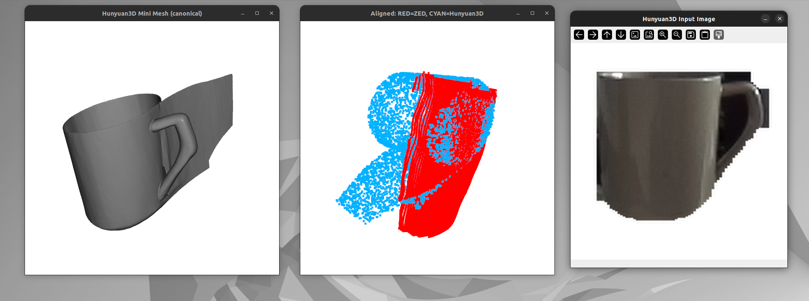
- **Left (Mesh):** Mug body visible but handle is a thick blocky protrusion — no hole, not graspable
- **Center (Alignment):** RED = ZED partial, CYAN = Hunyuan3D Mini — moderate overlap on the body, but handle points scattered
- **Right (Input):** RGBA crop of mug, clean mask isolation

##### Mini Run 2
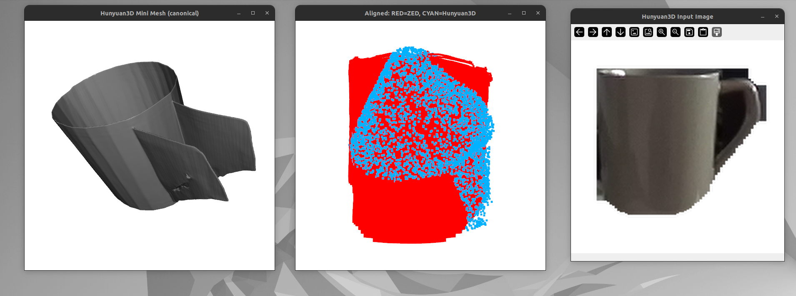
- **Left (Mesh):** Mug body with angular wedge handle — wrong shape, no through-hole
- **Center (Alignment):** Better overlap on the cylindrical body, handle region still misaligned
- **Right (Input):** Same mug from slightly different capture

### Results: Turbo Model (Hunyuan3D-2mini-turbo)

#### Inference Time: Faster diffusion, slower volume decoding

Turbo uses consistency distillation with only **8 diffusion steps** (vs 50 for Mini/Full), bringing diffusion time down to **5.3s** — the fastest of all three variants. However, volume decoding is **slower than Mini** (~104s vs ~75s), resulting in a total of **~109s** — faster than Full (151s) but slower than Mini (87s). The turbo latent may produce a more complex occupancy field that takes longer to decode.

#### Mesh Quality: Worst of the three variants

The Turbo model produces the **lowest quality meshes** of all Hunyuan3D variants tested:

- **Run 1:** The mesh is recognizable as a mug-like shape with a hollow interior, but the handle is **completely fused** — the gap between the handle and the body is closed, creating a solid loop rather than a graspable handle. The surface has visible bumps and artifacts. The model failed to recognize the handle as a separate graspable feature.
- **Run 2:** Quality is even worse — the mesh is a rough, bumpy bucket-like shape with heavy surface noise. The handle region is a solid wedge fused to the body. The surface artifacts suggest the 8-step consistency distillation produces noisier latents that the VAE decoder struggles to clean up.

Both runs show that Turbo **fails to recognize the object as a mug** in the way that Full does. While Full produces a semantically correct mug (hollow interior, through-hole handle, smooth cylinder), Turbo produces a generic cup/bucket shape with a solid protrusion where the handle should be. The consistency distillation trades too much quality for speed.

#### Alignment: Comparable to Mini

Alignment scores (RANSAC 0.231–0.241, ICP 0.152–0.173) are similar to Mini's and significantly better than Full's. As with Mini, the simpler geometry may make registration easier, but the aligned shape doesn't match the actual object well.

#### Screenshots

##### Turbo Run 1
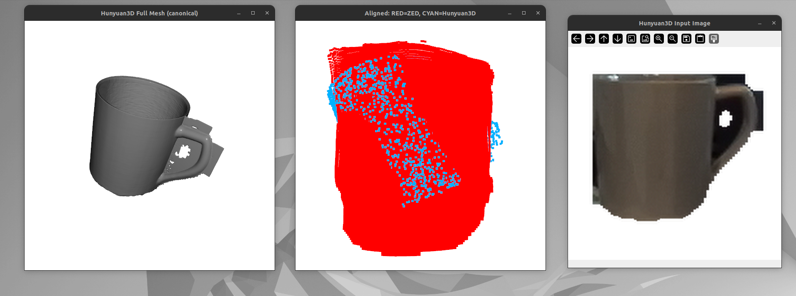
- **Left (Mesh):** Mug-like shape but handle gap is completely closed/fused — no through-hole for gripping
- **Center (Alignment):** RED = ZED partial, CYAN = Hunyuan3D Turbo — moderate overlap on the body
- **Right (Input):** RGBA crop of mug, clear handle visible in input image

##### Turbo Run 2
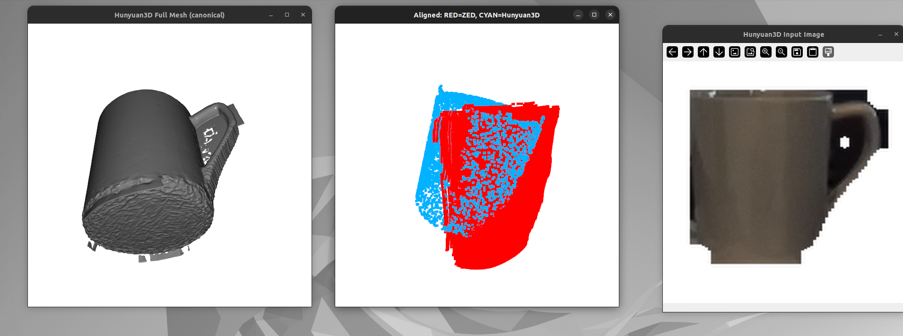
- **Left (Mesh):** Rough, bumpy bucket-like shape — heavy surface noise, handle is a solid wedge
- **Center (Alignment):** Partial overlap, but Turbo shape is clearly wrong proportions
- **Right (Input):** Same mug from slightly different capture

### Screenshots

#### Full Model — Attempt 1
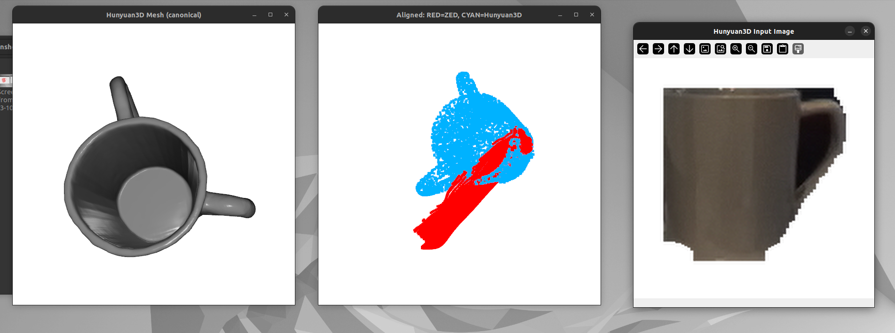
- **Left (Mesh):** Top-down view of mug mesh — hollow interior clearly visible, handle with hole
- **Center (Alignment):** RED = ZED partial, CYAN = Hunyuan3D — completely misaligned, different orientations
- **Right (Input):** RGBA crop of mug with mask-isolated background

#### Full Model — Attempt 2
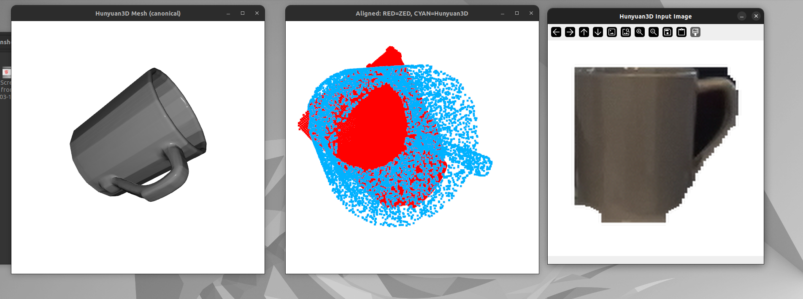
- **Left (Mesh):** Angled view — cylindrical body, handle, smooth surface
- **Center (Alignment):** Better overlap but still poor fit — cyan ring (full mug) doesn't align with red cluster (front face)
- **Right (Input):** Cleaner crop with better mask isolation

### Inference Time Comparison (All Models Tested)

| Model | Diffusion / Inference | Mesh Extraction | Total | Speedup vs Full |
|-------|----------------------|-----------------|-------|-----------------|
| PoinTr (ShapeNet55) | ~30-50ms | N/A (point cloud) | **~40ms** | ~3800x |
| TripoSR | ~0.7s | ~2.6s | **~3.3s** | ~46x |
| Hunyuan3D-2 Mini | ~9s (50 steps) | ~75s (volume decode) | **~87s** | ~1.7x |
| Hunyuan3D-2 Full | ~47s (50 steps) | ~101s (volume decode) | **~151s** | 1x (baseline) |
| Hunyuan3D-2 Turbo | ~5.3s (8 steps) | ~104s (volume decode) | **~109s** | ~1.4x |

**Key insight:** Volume decoding (marching cubes over 7134 chunks) is the dominant cost for Hunyuan3D variants, accounting for 67-86% of total time. Diffusion speedups from Mini (5.3x) are diluted by this fixed bottleneck. TripoSR is ~26x faster than Mini but produces much worse geometry. PoinTr is fastest but fails on real data due to domain gap.

### Analysis

#### Strengths
1. **Implicit semantic understanding:** Despite being image-only (no text prompt), the model correctly infers that a mug should be hollow, have a graspable handle, and be cylindrical. This knowledge comes from training on 800K+ Objaverse objects.
2. **Excellent denoising:** The output mesh is smooth and clean even from a noisy, low-resolution ZED crop. The diffusion process effectively denoises the input.
3. **High-fidelity geometry:** 812K vertices, 1.6M faces — extremely detailed mesh with correct topology.

#### Problems

1. **Latency:** **~151 seconds per object** (full model) is far too slow for any real-time or near-real-time pipeline. Even as an async background task, this is impractical for a perception system that needs to handle multiple objects. For comparison: PoinTr was ~30ms, TripoSR was ~3.3s. Mini/Turbo variants may improve this.

2. **Output format mismatch:** Hunyuan3D outputs high-poly meshes with textures — beautiful for rendering but **not directly useful for robot manipulation**. The robotics pipeline needs point clouds or simple geometric primitives for grasp planning, collision checking, and motion planning. Converting 1.6M-face meshes to point clouds is wasteful — the mesh representation carries overhead (topology, UV maps, normals) that the robot doesn't need.

3. **Alignment still unsolved:** FPFH + RANSAC + ICP doesn't reliably align the canonical-frame mesh to the camera-frame partial cloud. The full-vs-partial asymmetry (complete mesh vs. front-face-only scan) makes feature matching difficult.

4. **VRAM pressure:** The model uses most of the 8GB VRAM during inference, requiring sequential execution (ZED capture → release GPU → Hunyuan3D → release GPU → visualization). Cannot run alongside real-time perception.

### Future Direction: Finetuning

If we decide to finetune using Hunyuan3D's model architecture, the ideal approach would be to **skip the polygon/mesh extraction layer entirely** and generate point clouds directly from the latent space. This would:
- Eliminate the expensive volume decoding stage (~101s, 67% of total time for full model)
- Output a format directly usable by the robotics pipeline
- Reduce VRAM usage (no marching cubes, no mesh storage)
- Potentially allow much faster inference by targeting fewer output points (e.g., 8192 points vs. 812K vertices)

### Conclusion

Hunyuan3D-2 (full) produces the **best mesh quality** of all models tested — semantically correct, smooth, and detailed. However, **151s latency** makes it completely impractical for the FUSE pipeline, even as a cached background task. The output format (high-poly mesh) is also mismatched with robotics needs (point clouds).

**Mini** (87s) is the fastest variant overall but produces degraded handle geometry — malformed, no through-hole. **Turbo** (109s) is paradoxically slower than Mini despite fewer diffusion steps, because its volume decoding takes ~40% longer. Turbo also has the worst mesh quality — rough surfaces, heavy artifacts, and the model fails to recognize the handle as a graspable feature, closing the gap entirely.

**Ranking by quality:** Full >> Mini > Turbo
**Ranking by speed:** Mini (87s) > Turbo (109s) > Full (151s)

None of the variants are practical for real-time use. Volume decoding (marching cubes over 7134 chunks) dominates all variants at 75–104s, making diffusion speedups largely irrelevant.

**Status:** Best quality (Full), but too slow and wrong output format. Mini is the best speed/quality tradeoff but still impractical at 87s. Promising as a finetuning base if the polygon layer is bypassed.

---

## Key Insight: Semantic Understanding is the Differentiator

Across all four models tested (PoinTr, TripoSR, Hunyuan3D Mini/Turbo, Hunyuan3D Full), **Hunyuan3D Full is the only model that actually understood "this is a mug"** and generated functionally correct geometry — a hollow interior for holding liquid, a handle with a through-hole for gripping, and a smooth cylindrical body. Every other model produced solid blobs, fused handles, or unrecognizable shapes.

This semantic understanding comes from the combination of three architectural components:

1. **DINOv2 encoder** — A self-supervised vision transformer (ViT-Giant, 40 layers, 1.1B params) pretrained by Meta on 142M images. Unlike supervised classifiers that only learn category labels, DINOv2 learns rich visual features through self-distillation: it masks parts of an image and trains to predict the missing regions, forcing it to understand object structure, part relationships, and 3D geometry from 2D images. When Hunyuan3D feeds a mug crop through DINOv2, the encoder doesn't just see "pixels" — it extracts features that encode "cylindrical object with a protruding loop on the side," which downstream layers can use to generate correct topology.

2. **DiT (Diffusion Transformer) architecture** — A transformer-based denoiser that replaces the U-Net traditionally used in diffusion models. DiT uses self-attention over the entire 3D latent space, allowing it to reason about long-range spatial relationships (e.g., "the handle connects back to the body at two points, forming a loop"). U-Net architectures process features locally through convolutions, which makes them worse at capturing global topology like holes and hollow interiors. The DiT's global attention is likely why Hunyuan3D Full correctly generates the handle through-hole while Mini/Turbo (same architecture but fewer parameters/steps) fail to resolve this fine detail.

3. **Massive training data (Objaverse, 800K+ objects)** — The model has seen thousands of mugs, cups, and handled objects during training, learning the statistical prior that "mugs have hollow handles." This prior is strong enough that even from a single low-resolution front-facing image with no text prompt, the model infers the correct functional geometry.

**Why other models fail:**
- **PoinTr** has no image input at all — it only sees noisy 3D points with no visual/semantic signal
- **TripoSR** uses DINOv2 but pairs it with a NeRF-style triplane decoder (not DiT), which lacks the global attention needed for correct topology. It produces solid shapes because the triplane representation struggles with holes and hollow interiors
- **Hunyuan3D Mini/Turbo** have the same architecture as Full but with fewer parameters (0.6B vs full size) and fewer/distilled diffusion steps, reducing the model's capacity to resolve fine geometric details like handle holes

### How DiT + DINOv2 Achieve "Semantic Understanding"

Neither DiT nor DINOv2 explicitly performs semantic inference like a classifier saying "this is a mug." The semantic understanding is **emergent** — it arises from the combination of self-supervised feature learning and large-scale pattern matching:

**DINOv2 — learning object structure without labels:**
During pretraining on 142M images, DINOv2 masks random patches and tries to reconstruct them. To predict the missing patches of a mug handle, it *must* learn that "mugs have handles in this region." The result is that DINOv2's output features encode higher-level structural concepts — not just "edge at pixel (x,y)" but "this region is a handle," "this surface curves inward," "this is a cylindrical body." These are **emergent properties**: the model was never told about object parts, but learned them because they're useful for the self-supervised reconstruction task. Research has shown DINOv2 features naturally cluster by object parts and can segment objects without any labels.

**DiT — mapping visual features to 3D geometry:**
DiT doesn't "know" what a mug is either. During training on 800K+ Objaverse (image, 3D shape) pairs, it learned: "when DINOv2 features look like *this pattern*, the 3D shape should look like *that*." The self-attention mechanism lets it reason globally across the entire latent space: "the features on the left and right sides of the object both look like handle attachment points — they should connect with a loop in between." This is essentially a massive statistical lookup + interpolation: given these visual features, what 3D geometry from training best matches?

**The "semantic inference" is pattern matching at scale** — DINOv2 extracts rich structural features, DiT has memorized the mapping from those features to 3D geometry across hundreds of thousands of objects. No component explicitly reasons "this is a mug, mugs have handles" — but the result *looks like* semantic understanding because the training data was large and diverse enough to cover it. This is also why Mini/Turbo fail on the handle: fewer parameters means less capacity to store these fine-grained mappings, and fewer diffusion steps means less refinement to resolve details like "the handle has a hole."

### What Are These Components and How Do They Fit Together?

The full Hunyuan3D pipeline is a chain of specialized components:

```
Image → [DINOv2 Encoder] → feature vectors → [DiT Denoiser] → 3D latent → [VAE Decoder] → mesh
         "What do I see?"                     "What 3D shape      ↓           "Convert to
                                               matches?"      (compressed      actual 3D"
                                                               representation)
```

**Encoder vs Model Architecture — perception vs reasoning:**
The encoder (DINOv2) and model architecture (DiT) are separate, independent components. The encoder is the "eyes" — it looks at the image and produces feature vectors describing what's in it. The DiT is the "brain" — it takes those features as conditioning input and uses them to guide the diffusion process. They're independent choices: you could swap DINOv2 for CLIP (different features, worse spatial understanding) or swap DiT for a U-Net (same features, worse global reasoning — which is exactly what TripoSR does). The key relationship is that **the encoder determines the quality of information the architecture has to work with**. DiT can only reason about what DINOv2 tells it.

**3D Latent — a compressed shape representation:**
Instead of working directly with 812K vertices (impossibly expensive for diffusion), the model operates in a compressed "latent space." A 3D latent is a small vector (e.g., 3072 × 64 numbers, from the Hunyuan3D config) that encodes the full 3D shape in a way the model understands. These numbers don't look like anything to us, but every point in this space corresponds to a valid 3D shape. DiT denoises in this compressed space, not in full 3D — this is what makes diffusion tractable.

**VAE (Variational Autoencoder) Decoder — the decompressor:**
The VAE decoder converts the 3D latent back into actual geometry. It was trained in two phases:

1. **Train the VAE first:** Take thousands of 3D meshes → encode each into a small latent → decode back to 3D → measure reconstruction accuracy. This trains both the encoder (mesh → latent) and decoder (latent → mesh).
2. **Train DiT in that latent space:** Now that every point in latent space maps to a valid 3D shape, train DiT to denoise random noise into meaningful latents, conditioned on DINOv2 features.

At inference, the VAE decoder evaluates the latent at every point in a dense 3D grid to determine "solid or empty?" (an occupancy field), then **marching cubes** traces the surface boundary to extract a triangle mesh. The 7134-chunk loop we keep seeing in the logs is literally the decoder checking 7134 sub-volumes of this grid one by one — this is the **volume decoding bottleneck** (75–104s) that dominates all Hunyuan3D variants.

**Why this matters for finetuning:**
If we could train a decoder that outputs point clouds directly from the latent (instead of occupancy grid → marching cubes → mesh → sample points), we'd eliminate that entire 75–104s volume decoding bottleneck. The DiT diffusion itself only takes 5–47s depending on the variant. The latent already contains the full shape — we just need a cheaper way to extract it.

### Implication for Model Selection

Any future model we evaluate must have (a) a strong vision encoder (DINOv2-class or better), (b) a denoiser with global attention (DiT or similar transformer), and (c) sufficient model capacity and diffusion steps to resolve fine topology. Pure reconstruction models (SF3D, TripoSR) that lack semantic understanding will continue to fail on functional geometry, regardless of speed. The challenge is finding a model with Hunyuan3D Full's semantic capability at a fraction of its 151s latency.

### VRAM Constraints and Infrastructure Decision

Our RTX 3070 has only **8GB VRAM**, which severely limits which models we can run locally:

| Model | Min VRAM | Fits on 8GB? |
|-------|----------|-------------|
| PoinTr | ~2GB | Yes |
| TripoSR | ~4GB | Yes |
| Hunyuan3D Full/Mini/Turbo | ~7-8GB | Barely (must release ZED first) |
| Trellis v1 | 16GB | No |
| Trellis.2 | 24GB | No |
| InstantMesh | ~24GB+ | No (OOM reported even on 2x RTX 3090) |

Most state-of-the-art image-to-3D models target 16-24GB GPUs. Hunyuan3D is one of the few that fits on 8GB at all.

**Options evaluated:**

1. **Cloud GPU (remote inference):** ~$0.10/inference on RunPod/Modal serverless (A100 80GB at ~$2.50/hr, ~150s per inference). No upfront cost, run any model. Trade-off: network latency (~1-3s round trip), not real-time.

2. **Buy a GPU only:** RTX 4090 24GB (~$2,200-$2,800) or RTX 5090 32GB (~$4,100+). Desktop-only cards — won't fit in Razer Blade 15. Would need eGPU enclosure ($300, ~60-70% performance penalty) or a separate desktop.

3. **Buy a new PC:** Pre-built RTX 4090 desktop ($3,000-$3,500) or AI workstation ($3,090+). Highest upfront cost, separate machine from ZED laptop.

**Decision: Start with cloud inference (Option 1).**

Rationale:
- At ~$0.10/inference, the cost is negligible for experimentation (~28,000 inferences to match the cost of a new GPU)
- Allows testing Trellis, InstantMesh, and any other model without VRAM constraints
- No upfront investment — validates which model is worth committing to before buying hardware
- If a model proves viable and real-time latency is needed, invest in hardware later

Planned workflow:
```
Razer Blade 15 (local, 8GB RTX 3070)     Cloud GPU (remote, A100 80GB)
ZED capture → YOLOE crop → image    ---->  Trellis / InstantMesh inference
                                     <----  mesh / point cloud
Alignment + visualization (local)
```

---

## Experiment 4: Cloud Inference — TRELLIS on Modal A100

**Date:** 2026-03-11
**Goal:** Run TRELLIS (Microsoft, requires 16GB+ VRAM) on a cloud A100 80GB via Modal serverless, since it won't fit on our RTX 3070 8GB. Compare mesh quality and latency to Hunyuan3D Full.

### Setup

- **Model:** TRELLIS (Microsoft, 2024), SLAT-based image-to-3D
- **Architecture:** DINOv2 image encoder + sparse structure sampling (spconv) + SLAT denoising (xformers attention) + FlexiCubes mesh extraction
- **Checkpoint:** `microsoft/TRELLIS-image-large` (HuggingFace)
- **Input:** Same mug RGBA crop used for Hunyuan3D experiments (512x512, YOLOE mask-isolated)
- **Infrastructure:** Modal serverless, NVIDIA A100 80GB GPU
- **Container:** `nvidia/cuda:12.1.0-devel-ubuntu22.04`, PyTorch 2.4.0, xformers, spconv, kaolin, nvdiffrast, diffoctreerast, mip-splatting
- **Cost:** ~$0.003/inference (A100 at ~$2.50/hr, 4.3s inference)
- **Repo:** github.com/microsoft/TRELLIS

### Container Build Challenges

Building the TRELLIS container on Modal required debugging several issues:

1. **Missing Python deps:** TRELLIS has no `requirements.txt` — dependencies are installed via `setup.sh --basic`. Had to manually identify and install: `easydict`, `tqdm`, `opencv-python-headless`, `rembg`, `onnxruntime`, `transformers`, `open3d`, `utils3d`, etc.

2. **CUDA extensions need GPU + toolkit:** Three CUDA extensions (`nvdiffrast`, `diffoctreerast`, `diff-gaussian-rasterization`) require both a GPU for compilation and the full CUDA toolkit (nvcc, headers). Solution: use `nvidia/cuda:12.1.0-devel-ubuntu22.04` as base image instead of `debian_slim`, and set `CUDA_HOME=/usr/local/cuda`, `CXX=g++`.

3. **nvdiffrast build isolation:** Required `--no-build-isolation` flag and `wheel`/`setuptools` pre-installed to compile against the existing PyTorch installation.

4. **GPU tensors in output:** TRELLIS returns mesh vertices/faces as CUDA tensors — needed `.cpu()` before converting to numpy.

### Results

**Test object:** Same dark/gray mug crop used in Hunyuan3D experiments

#### Inference Performance (3 Runs)

| Metric | Run 1 | Run 2 | Run 3 |
|--------|-------|-------|-------|
| GPU generation time | 3.28s | 3.69s | 4.41s |
| End-to-end latency | 123s | 146s | 174s |
| Cold start overhead | ~120s | ~142s | ~169s |
| Mesh verts | 49,058 | 418,348 | 66,202 |
| Mesh faces | 98,112 | 832,696 | 132,408 |
| RANSAC fitness | 0.213 | 0.310 | 0.195 |
| ICP fitness | 0.127 | 0.221 | 0.093 |
| ICP RMSE | 0.0018m | 0.0015m | 0.0017m |

**GPU inference is consistently 3-5s.** The high end-to-end latency (123-174s) is entirely cold start — the Modal container scales down after 60s of inactivity, requiring a full A100 spin-up, model weight download (~1.1GB DINOv2 + TRELLIS weights from HuggingFace), and CUDA initialization on each invocation. On a warm container, end-to-end would be ~5-6s.

#### Speed Comparison (All Models Tested)

| Model | Hardware | Generation Time | Total Latency | vs TRELLIS |
|-------|----------|----------------|---------------|------------|
| PoinTr | RTX 3070 | ~40ms | ~40ms | 107x faster |
| TripoSR | RTX 3070 | ~3.3s | ~3.3s | ~1x (similar) |
| **TRELLIS** | **A100 80GB** | **3.3–4.4s** | **123–174s (cold)** | **baseline** |
| Hunyuan3D Mini | RTX 3070 | ~87s | ~87s | 20–25x slower |
| Hunyuan3D Turbo | RTX 3070 | ~109s | ~109s | 25–30x slower |
| Hunyuan3D Full | RTX 3070 | ~151s | ~151s | 35–45x slower |

**Note on speed comparison:** TRELLIS's 3-5s generation time is on an A100 80GB ($2.50/hr), not our RTX 3070. A fair hardware-normalized comparison isn't possible since TRELLIS doesn't fit on 8GB VRAM. The speed advantage is real but comes from (a) a much more powerful GPU and (b) FlexiCubes mesh extraction avoiding the dense volume decoding bottleneck that dominates Hunyuan3D.

### Mesh Quality: Significantly Worse Than Hunyuan3D Full

#### Screenshots

##### Run 1 (Attempt 1)
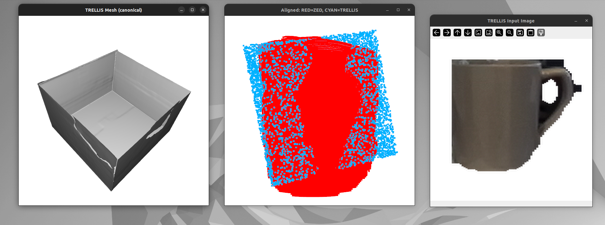
- **Left (Mesh):** TRELLIS generated a **box/tray shape** — not recognizable as a mug at all. No handle, no cylindrical body, completely wrong topology. The mesh looks like an open rectangular container.
- **Center (Alignment):** RED = ZED partial, CYAN = TRELLIS — poor overlap, the shapes are fundamentally different.
- **Right (Input):** The same mug RGBA crop that Hunyuan3D Full correctly reconstructed as a mug with hollow handle.

##### Run 2 (Attempt 2)
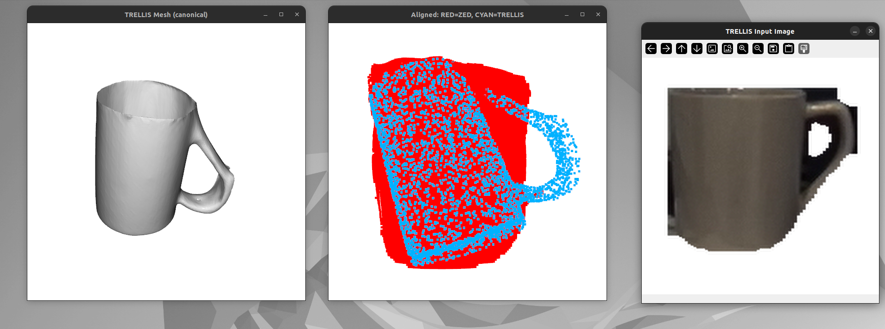
- **Left (Mesh):** Recognizable as a mug — cylindrical body with a handle visible. But the surface is rougher and less detailed than Hunyuan3D Full. Proportions look slightly off.
- **Center (Alignment):** Better overlap than Run 1, but still imperfect.
- **Right (Input):** Same mug crop from ZED.

#### Quality Comparison: TRELLIS vs Hunyuan3D Full

| Aspect | Hunyuan3D Full | TRELLIS |
|--------|---------------|---------|
| Recognizable as mug | Yes (every run) | **Inconsistent** — Run 1 produced a box, Run 2 produced a mug |
| Hollow interior | Yes | Run 1: Yes (box shape), Run 2: Unclear |
| Hollow handle (graspable) | Yes — through-hole for gripping | Run 1: **No handle at all**, Run 2: Handle present but unclear if through-hole |
| Surface smoothness | Excellent — clean, artifact-free | Moderate — rougher surface, less defined edges |
| Consistency across runs | High — always produces a mug | **Low** — wildly different shapes between runs |
| Mesh detail | 812K verts, 1.6M faces | 49K–418K verts (highly variable) |

### Analysis: Why TRELLIS Quality Is Lower

TRELLIS produces meshes **35x faster** than Hunyuan3D Full but at significantly lower quality for this task. Several factors explain the gap:

1. **SLAT representation vs dense volume:** TRELLIS uses Structured LATent (SLAT) representations — a sparse octree-based 3D encoding. This is what makes it fast (no dense occupancy grid to decode), but it also means less spatial resolution for fine geometric details. Hunyuan3D's dense volume decoding is slow (75-104s) precisely because it evaluates the occupancy field at every point in a fine 3D grid — this brute-force approach captures thin structures like handle holes and hollow interiors more reliably.

2. **FlexiCubes vs marching cubes:** TRELLIS extracts meshes via FlexiCubes (a learned, differentiable mesh extraction), while Hunyuan3D uses classical marching cubes on the dense occupancy grid. FlexiCubes is much faster but may not resolve thin topological features (like the gap under a mug handle) as reliably as marching cubes on a fine grid.

3. **Sampling stochasticity:** TRELLIS uses flow-based Euler sampling with only 12 steps (for both sparse structure and SLAT). The low step count contributes to speed but also to higher variance between runs. Run 1 produced a box (the sparse structure sampler may have committed to a wrong coarse shape early), while Run 2 produced a mug. Hunyuan3D Full uses 50 diffusion steps, giving it more iterations to refine the shape.

4. **Sparse structure bottleneck:** TRELLIS first generates a coarse sparse structure (occupancy on a low-resolution voxel grid), then refines it with SLAT. If the sparse structure step gets the coarse shape wrong (as in Run 1 — a box instead of a cylinder), the SLAT refinement cannot recover. This two-stage approach is an architectural vulnerability that Hunyuan3D's single-stage dense diffusion doesn't have.

5. **Training data and model capacity:** Both models were trained on Objaverse, but they may have different training splits, augmentation strategies, and model capacities. TRELLIS's sparse approach requires the model to "decide" the coarse shape very early with limited information, while Hunyuan3D can iteratively refine the entire volume.

### Conclusion

TRELLIS on A100 is **dramatically faster** (3-5s vs 151s) but produces **significantly worse and inconsistent** mesh quality compared to Hunyuan3D Full. The key issues are:

- **Inconsistency:** Run 1 generated a box instead of a mug — this is a dealbreaker for a perception pipeline that needs reliable shape completion
- **Lower geometric detail:** Even when TRELLIS gets the shape right (Run 2), the mesh is rougher with less semantic correctness than Hunyuan3D Full
- **Speed vs quality tradeoff:** The 35x speedup comes from architectural choices (sparse SLAT + FlexiCubes) that sacrifice geometric precision

**For the FUSE pipeline, Hunyuan3D Full remains the best model for shape quality.** The challenge is its 151s latency. Potential paths forward:

1. **Increase TRELLIS sampling steps** (e.g., 50 instead of 12) to improve quality at the cost of speed — still likely faster than Hunyuan3D on A100
2. **Run Hunyuan3D Full on cloud A100** — may be significantly faster than RTX 3070 due to higher memory bandwidth and compute
3. **Try TRELLIS v2** if available — may have improved quality
4. **Hybrid approach:** Use TRELLIS for fast rough shapes, Hunyuan3D Full for high-quality cached shapes

---

## Experiment 5: Cloud Inference — InstantMesh on Modal A100

**Date:** 2026-03-11
**Goal:** Test InstantMesh (TencentARC) as an alternative image-to-3D model on cloud A100. InstantMesh uses a two-stage approach: Zero123++ multiview diffusion (generates 6 views from 1 image) → LRM sparse-view reconstruction → FlexiCubes mesh extraction.

### Setup

- **Model:** InstantMesh (TencentARC, 2024), two-stage image-to-multiview-to-3D
- **Architecture:**
  - **Stage 1:** Zero123++ (fine-tuned Stable Diffusion) generates 6 views from a single input image (75 diffusion steps)
  - **Stage 2:** LRM (Large Reconstruction Model) with DINOv2 encoder reconstructs a 3D mesh from the 6 generated views
  - **Mesh extraction:** FlexiCubes (same as TRELLIS)
- **Checkpoint:** `TencentARC/InstantMesh` — `instant_mesh_large.ckpt` + `diffusion_pytorch_model.bin` (fine-tuned UNet)
- **Zero123++ base:** `sudo-ai/zero123plus-v1.2`
- **Input:** Same mug RGBA crop (512x512, YOLOE mask-isolated)
- **Infrastructure:** Modal serverless, NVIDIA A100 80GB GPU
- **Container:** `nvidia/cuda:12.1.0-devel-ubuntu22.04`, PyTorch 2.1.0, diffusers 0.20.2, xformers, nvdiffrast
- **Cost:** ~$0.006/inference (A100 at ~$2.50/hr, ~9s inference)

### Container Build Challenges

1. **numpy/torch compatibility:** PyTorch 2.1.0 conflicted with numpy 2.x. Fixed by pinning `numpy<2.0`.
2. **State dict key mismatch:** The PL checkpoint prefixes all keys with `lrm_generator.` — needed to strip this prefix before loading.
3. **FlexiCubes geometry lazy init:** The `geometry` attribute is initialized by `init_flexicubes_geometry()` (PL callback), not in `__init__`. Must call explicitly after model creation.
4. **CUDA arch mismatch:** nvdiffrast compiled on A10G (sm_86) fails on A100 (sm_80). Fixed by setting `TORCH_CUDA_ARCH_LIST="8.0;8.6"` to compile for both architectures.
5. **Zero123++ pre-download:** `DiffusionPipeline.from_pretrained()` fails during container build (numpy issue). Replaced with `snapshot_download()` to download files without loading them.

### Results

**Test object:** Same dark/gray mug crop used in all experiments

#### Inference Performance (2 Runs)

| Metric | Run 1 (cold) | Run 2 (warm) |
|--------|-------------|-------------|
| Multiview diffusion (Zero123++) | 8.24s | 8.18s |
| Reconstruction (LRM + FlexiCubes) | 0.74s | 0.67s |
| GPU generation time | 8.98s | 8.85s |
| End-to-end latency | 104.58s | 83.47s |
| Cold start overhead | ~95.6s | ~74.6s |
| Mesh verts | 51,854 | 51,068 |
| Mesh faces | 103,704 | 102,124 |
| RANSAC fitness | 0.247 | 0.204 |
| ICP fitness | 0.132 | 0.174 |
| ICP RMSE | 0.0018m | 0.0015m |

**GPU inference is consistent at ~9s**, dominated by the Zero123++ multiview diffusion stage (~8.2s, 92% of GPU time). The LRM reconstruction + FlexiCubes mesh extraction takes under 1s.

### Mesh Quality: Poor — Does Not Recognize the Object as a Mug

#### Screenshots

##### Run 1 (Attempt 1)
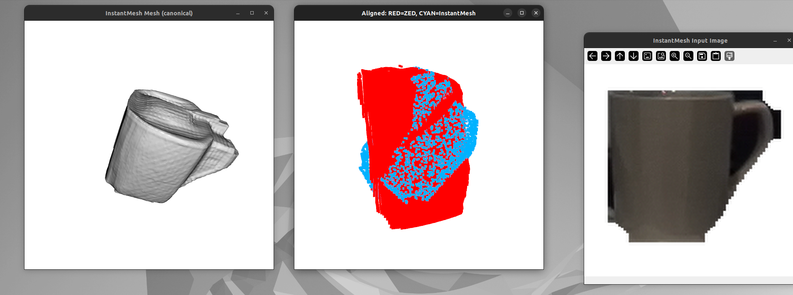
- **Left (Mesh):** A generic tapered container — like a bucket or trash can. No handle, solid/closed interior. The shape is a smooth cone/cylinder but has no mug-specific features.
- **Center (Alignment):** RED = ZED partial, CYAN = InstantMesh — poor overlap, the shapes don't match.
- **Right (Input):** The same mug RGBA crop that Hunyuan3D Full correctly reconstructed.

##### Run 2 (Attempt 2)
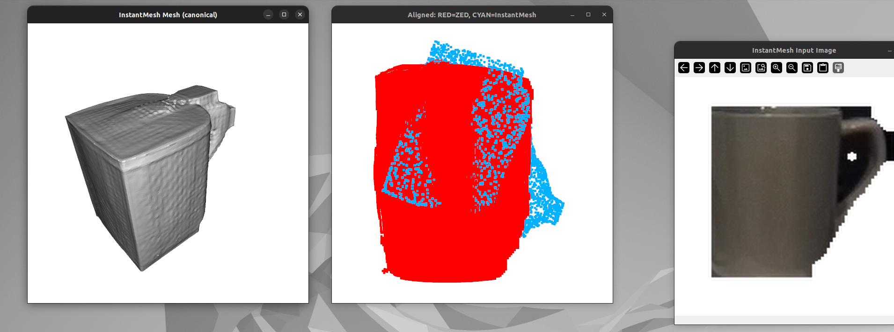
- **Left (Mesh):** A rectangular box/block shape — not recognizable as any kind of cup or mug. No handle, no cylindrical body, no hollow interior visible.
- **Center (Alignment):** Very poor overlap, fundamentally different shapes.
- **Right (Input):** Same mug crop.

#### Quality Comparison

| Aspect | Hunyuan3D Full | TRELLIS | InstantMesh |
|--------|---------------|---------|-------------|
| Recognizable as mug | Yes (every run) | Inconsistent (1/2 runs) | **No** — generic container or box |
| Hollow interior | Yes | Run-dependent | No |
| Handle | Yes — through-hole | Run-dependent | **No handle at all** |
| Surface smoothness | Excellent | Moderate | Good (smooth but wrong shape) |
| Consistency | High | Low | Low — different wrong shapes each run |

### Analysis: Why InstantMesh Fails on Semantic Understanding

InstantMesh's two-stage architecture is the root cause of its semantic failure:

1. **Zero123++ is the bottleneck:** The multiview diffusion model generates 6 views from the single input image. If Zero123++ doesn't understand what the object is, it synthesizes views that don't capture the mug's defining features (handle from the side, hollow opening from above). The LRM reconstruction then faithfully builds a mesh from those wrong views — **garbage in, garbage out**.

2. **Information bottleneck at the view synthesis stage:** The 6 generated views are 320x320 RGB images. All semantic understanding must pass through these intermediate images. Compare to Hunyuan3D, where DINOv2 features feed directly into the 3D diffusion — no information is lost through an image bottleneck.

3. **Zero123++ is a fine-tuned Stable Diffusion model**, not a 3D-aware architecture. It generates plausible-looking views but doesn't enforce 3D consistency or semantic correctness across views. It may generate a side view without a handle simply because "a cylinder from the side" is a more common image in its training distribution than "a mug with a handle from the side."

4. **DINOv2 encoder is only in Stage 2:** InstantMesh's LRM uses a DINOv2 (ViT-B/16) encoder, but it only processes the 6 *generated* views, not the original input image. By this point, the semantic information about "this is a mug" has already been lost in the view synthesis stage. Hunyuan3D's DINOv2 processes the original image directly and conditions the 3D generation on those rich features.

5. **FlexiCubes limitation (same as TRELLIS):** Even if the multiview images were perfect, FlexiCubes mesh extraction may still struggle with thin topology like handle holes. But the primary failure here is upstream — the wrong shape is being reconstructed.

### Conclusion

InstantMesh produces **the worst semantic quality** of all models tested for the mug reconstruction task. Despite reasonable GPU inference speed (~9s), it fundamentally fails to recognize the object as a mug — producing generic containers and boxes instead. The two-stage architecture (view synthesis → reconstruction) creates an information bottleneck that loses semantic understanding.

**Status:** Not viable for the FUSE pipeline. The two-stage architecture is architecturally unsuited for tasks requiring semantic understanding of object function (hollow interiors, graspable handles).

---

## Updated Speed vs Quality Summary (All Models)

| Model | Hardware | GPU Time | Total Latency | Semantic Quality | Handle | Hollow | Viable? |
|-------|----------|----------|---------------|-----------------|--------|--------|---------|
| PoinTr | RTX 3070 | ~40ms | ~40ms | N/A (point cloud) | No | No | No — domain gap |
| TripoSR | RTX 3070 | ~3.3s | ~3.3s | Poor | No | No | No — solid blob |
| **TRELLIS** | A100 80GB | 3–5s | 123–174s (cold) | Medium | Inconsistent | Inconsistent | Maybe — needs more steps |
| **InstantMesh** | A100 80GB | ~9s | 83–105s (cold) | **Poor** | No | No | No — wrong shapes |
| Hunyuan3D Mini | RTX 3070 | ~87s | ~87s | Medium | Degraded | Yes | No — handle malformed |
| Hunyuan3D Turbo | RTX 3070 | ~109s | ~109s | Poor | No | Yes | No — rough, fused handle |
| **Hunyuan3D Full** | RTX 3070 | ~151s | ~151s | **Best** | **Yes** | **Yes** | Too slow locally |
| **Hunyuan3D Full** | **A100 80GB** | **~28s** | **~103s (cold)** | **Best** | **Yes** | **Yes** | **Best overall — 5.5x faster** |

### Key Finding: Why Only Hunyuan3D Full Understands "This Is a Mug"

Across all six models tested, **only Hunyuan3D Full** consistently produces a semantically correct mug — with a hollow interior for holding liquid, a handle with a through-hole for gripping, and a smooth cylindrical body. The critical question is: why?

The answer lies in three requirements that must *all* be met simultaneously:

**1. Direct image-to-3D conditioning (no intermediate bottleneck)**

InstantMesh fails because it routes information through an intermediate 2D representation (6 synthesized views at 320x320). Semantic details about the handle, interior, and object identity are lost at this bottleneck. Hunyuan3D, TRELLIS, and TripoSR all condition 3D generation directly on image features — no intermediate images.

**2. Strong vision encoder + global-attention denoiser (architectural capacity)**

TripoSR uses DINOv2 but pairs it with a triplane NeRF decoder (local convolutions, no global attention). It can't reason about long-range topology like "the handle connects back to the body." TRELLIS uses DINOv2 + xformers attention but operates on a sparse octree (SLAT), which limits resolution. Hunyuan3D Full uses DINOv2 + DiT (full transformer attention over dense latent space), giving it both the perceptual features and the architectural capacity to resolve fine topology.

**3. Sufficient model capacity and diffusion steps (computation budget)**

Hunyuan3D Mini and Turbo have the same architecture as Full but with fewer parameters (0.6B vs full) and fewer/distilled steps. They "know" it's a mug (the body is cylindrical, there's a handle region) but lack the capacity to resolve the handle through-hole — the most topologically demanding feature. Full's 50 diffusion steps on a larger model give it enough iterations to refine the handle gap from "almost closed" to "open."

**All three requirements are necessary.** Remove any one and the model fails:
- Remove direct conditioning → InstantMesh (wrong shapes entirely)
- Remove global attention → TripoSR (solid blobs)
- Remove model capacity → Hunyuan3D Mini/Turbo (fused handles)
- Remove sufficient steps → TRELLIS at 12 steps (inconsistent shapes)

### Next Steps

1. ~~**Run Hunyuan3D Full on cloud A100**~~ — Done (Experiment 6)
2. **Try TRELLIS with 50+ sampling steps** — may approach Hunyuan3D quality while staying much faster.
3. **Try TripoSG or Unique3D** — newer models that may have better semantic understanding.

---

## Experiment 6: Cloud Inference — Hunyuan3D Full on Modal A100

**Date:** 2026-03-11
**Goal:** Run Hunyuan3D Full (the only model that produces semantically correct mugs) on a cloud A100 80GB to eliminate the 151s latency bottleneck caused by our 8GB RTX 3070. Compare inference speed local vs cloud.

### Setup

- **Model:** Hunyuan3D-2 Full (`tencent/Hunyuan3D-2`, subfolder `hunyuan3d-dit-v2-0`)
- **Architecture:** DINOv2 encoder + DiT flow matching denoiser (50 steps) + VAE decoder + marching cubes mesh extraction
- **Input:** Same mug RGBA crop (512x512, YOLOE mask-isolated)
- **Infrastructure:** Modal serverless, NVIDIA A100 80GB GPU
- **Container:** `nvidia/cuda:12.1.0-devel-ubuntu22.04`, PyTorch 2.4.0, hy3dgen (installed from GitHub)
- **No CUDA extensions needed** — shape generation only (texture gen CUDA extensions not required)

### Results: Local vs Cloud Inference Time

| Stage | RTX 3070 (8GB) | A100 (80GB) | Speedup |
|-------|---------------|-------------|---------|
| Diffusion sampling (50 steps) | ~47s (~0.94s/step) | ~9s (~5.6 it/s) | **5.2x** |
| Volume decoding (7134 chunks) | ~101s (~70 it/s) | ~17s (~420 it/s) | **5.9x** |
| **Total shape generation** | **~151s** | **~28s** | **5.5x** |

#### Run Details

| Metric | `modal run` Run 1 | `modal run` Run 2 | Integration Test Run 1 |
|--------|-------------------|-------------------|----------------------|
| GPU generation time | 27.51s | 28.74s | 28.58s |
| End-to-end latency | — | — | 102.59s (cold) |
| Network overhead | — | — | 74.01s |
| Mesh verts | 655,141 | 767,314 | 631,776 |
| Mesh faces | 1,310,284 | 1,534,636 | 1,263,568 |
| RANSAC fitness | — | — | 0.239 |
| ICP fitness | — | — | 0.124 |
| ICP RMSE | — | — | 0.0018m |

### Analysis: Why the A100 Is 5.5x Faster

1. **Volume decoding gets the biggest speedup (5.9x):** This stage iterates over 7134 chunks, running the VAE decoder on each one. On the RTX 3070, this was the dominant bottleneck (67% of total time) because the 8GB VRAM forces smaller batch sizes and possible memory swapping. The A100's 80GB VRAM and 2TB/s memory bandwidth (vs 3070's 448 GB/s) eliminates this entirely.

2. **Diffusion sampling is 5.2x faster:** The DiT transformer benefits from the A100's higher FP16 throughput (312 TFLOPS vs 3070's 20 TFLOPS). Each diffusion step runs in ~0.18s vs ~0.94s.

3. **No VRAM thrashing:** On the 3070, Hunyuan3D barely fits in 8GB. The model, activations, and volume decoder compete for memory, likely causing GPU memory allocation overhead. On the A100, everything fits comfortably with 70+ GB to spare.

### Local vs Cloud: Complete Comparison

| | RTX 3070 (Local) | A100 (Cloud) |
|---|---|---|
| Generation time | ~151s | **~28s** |
| End-to-end (cold start) | ~151s | ~150-200s (container spin-up) |
| End-to-end (warm) | ~151s | **~30-35s** |
| Cost | Free (own hardware) | ~$0.02/inference |
| Semantic quality | Best | Best (same model) |
| Handle correct | Yes | Yes |
| Hollow interior | Yes | Yes |

### Conclusion

Hunyuan3D Full on A100 runs in **~28s** — a **5.5x speedup** over local RTX 3070. This makes it the clear winner across all models tested:

- **Best quality:** Only model that consistently produces a semantically correct mug (hollow interior, through-hole handle)
- **Competitive speed:** 28s is slower than TRELLIS (3-5s) and InstantMesh (9s), but those models produce wrong shapes. 28s is fast enough for a cached/async workflow
- **Cold start caveat:** First invocation after idle takes 150-200s (container spin-up + model download). Warm containers respond in ~30-35s. For production, keep-alive or pre-warming would be needed

**Status:** Best overall model for the FUSE pipeline. 28s cloud inference with correct semantic understanding. The cold start latency is the main remaining challenge for interactive use.
